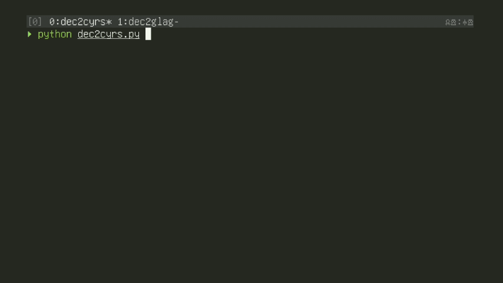

This script converts decimal numbers to Cyrillic numerals. It includes an option to add a titlo symbol to the result.

## Features

- Convert decimal numbers to Cyrillic numerals
- Optional titlo symbol addition
- Command-line interface
- Can be used as a Python module

## Requirements

- Python 3.x
- Bash

## Installation

### As a script

1. Clone this repository:

`git clone https://github.com/slojinika/dec2cyrs.git`

2. Navigate to the project directory:

`cd dec2cyrs`

## Usage

### As a script

Run the script from the command line:

python dec2cyrs.py [-h] [-t] number

Arguments:
- number: The decimal number to convert (required)
- -t, --titlo: Add titlo to the result (optional)
- -h, --help: Show help message and exit

### As a module

```python
from dec2cyrs import dec2cyrs

# Convert 888 to Cyrillic
result = dec2cyrs(888)
print(result)

# Convert 888 with titlo
result_with_titlo = dec2cyrs(888, use_titlo=True)
print(result_with_titlo)
```

## Examples
1. Convert 888 to Cyrillic:

`python dec2cyrs.py 888`

2. Convert 888 with titlo:

`python dec2cyrs.py -t 888`
